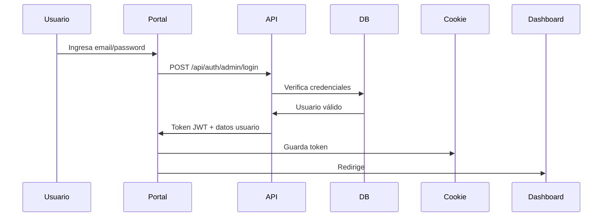

# 🔐 Documentación API - Portal Administrativo

## Base URL
```
https://casilleroback-production.up.railway.app
```

---

## 🎯 Autenticación de Administrador

### Login Admin
**Endpoint:** `POST /api/auth/admin/login`

**Request:**
```json
{
  "email": "admin@servientrega.com",
  "password": "Admin123!"
}
```

**Response (200 OK):**
```json
{
  "token": "eyJhbGciOiJIUzI1NiIsInR5cCI6IkpXVCJ9...",
  "email": "admin@servientrega.com",
  "name": "Administrador Principal",
  "role": "ADMIN",
  "message": "Login successful"
}
```

**Errores:**
- `400`: Credenciales inválidas
- `400`: Cuenta inactiva

---

## 🔑 Credenciales por Defecto

| Email | Password | Rol |
|-------|----------|-----|
| admin@servientrega.com | Admin123! | ADMIN |

⚠️ **IMPORTANTE:** Cambiar la contraseña después del primer login en producción.

---

## 📦 Implementación en Nuxt 3

### 1. Configuración Base

**`nuxt.config.ts`**
```typescript
export default defineNuxtConfig({
  runtimeConfig: {
    public: {
      apiBase: 'https://casilleroback-production.up.railway.app'
    }
  },
  modules: ['@pinia/nuxt']
})
```

### 2. Composable para API

**`composables/useApi.ts`**
```typescript
export const useApi = () => {
  const config = useRuntimeConfig()
  const baseURL = config.public.apiBase

  const api = $fetch.create({
    baseURL,
    onRequest({ options }) {
      const token = useCookie('auth-token').value
      if (token) {
        options.headers = {
          ...options.headers,
          Authorization: `Bearer ${token}`
        }
      }
    }
  })

  return { api }
}
```

### 3. Store de Autenticación

**`stores/auth.ts`**
```typescript
import { defineStore } from 'pinia'

interface User {
  email: string
  name: string
  role: string
}

export const useAuthStore = defineStore('auth', {
  state: () => ({
    user: null as User | null,
    token: null as string | null
  }),

  getters: {
    isAuthenticated: (state) => !!state.token,
    isAdmin: (state) => state.user?.role === 'ADMIN'
  },

  actions: {
    async login(email: string, password: string) {
      const { api } = useApi()
      
      try {
        const response = await api('/api/auth/admin/login', {
          method: 'POST',
          body: { email, password }
        })

        this.token = response.token
        this.user = {
          email: response.email,
          name: response.name,
          role: response.role
        }

        // Guardar token en cookie
        const tokenCookie = useCookie('auth-token', {
          maxAge: 60 * 60 * 8 // 8 horas
        })
        tokenCookie.value = response.token

        return response
      } catch (error) {
        throw new Error('Credenciales inválidas')
      }
    },

    logout() {
      this.token = null
      this.user = null
      const tokenCookie = useCookie('auth-token')
      tokenCookie.value = null
      navigateTo('/login')
    },

    async checkAuth() {
      const tokenCookie = useCookie('auth-token')
      if (tokenCookie.value) {
        this.token = tokenCookie.value
        // Aquí podrías hacer una llamada para obtener los datos del usuario
      }
    }
  }
})
```

### 4. Página de Login

**`pages/login.vue`**
```vue
<template>
  <div class="min-h-screen flex items-center justify-center bg-gray-100">
    <div class="max-w-md w-full bg-white rounded-lg shadow-md p-8">
      <h1 class="text-2xl font-bold text-center mb-6">
        Portal Administrativo
      </h1>

      <form @submit.prevent="handleLogin">
        <div class="mb-4">
          <label class="block text-gray-700 text-sm font-bold mb-2">
            Email
          </label>
          <input
            v-model="email"
            type="email"
            required
            class="w-full px-3 py-2 border border-gray-300 rounded-md focus:outline-none focus:ring-2 focus:ring-blue-500"
            placeholder="admin@servientrega.com"
          />
        </div>

        <div class="mb-6">
          <label class="block text-gray-700 text-sm font-bold mb-2">
            Contraseña
          </label>
          <input
            v-model="password"
            type="password"
            required
            class="w-full px-3 py-2 border border-gray-300 rounded-md focus:outline-none focus:ring-2 focus:ring-blue-500"
            placeholder="••••••••"
          />
        </div>

        <button
          type="submit"
          :disabled="loading"
          class="w-full bg-blue-600 text-white py-2 px-4 rounded-md hover:bg-blue-700 disabled:bg-gray-400"
        >
          {{ loading ? 'Iniciando sesión...' : 'Iniciar Sesión' }}
        </button>

        <div v-if="error" class="mt-4 text-red-600 text-sm text-center">
          {{ error }}
        </div>
      </form>
    </div>
  </div>
</template>

<script setup lang="ts">
const authStore = useAuthStore()
const router = useRouter()

const email = ref('')
const password = ref('')
const loading = ref(false)
const error = ref('')

const handleLogin = async () => {
  loading.value = true
  error.value = ''

  try {
    await authStore.login(email.value, password.value)
    router.push('/dashboard')
  } catch (err) {
    error.value = 'Credenciales inválidas'
  } finally {
    loading.value = false
  }
}
</script>
```

### 5. Middleware de Autenticación

**`middleware/auth.ts`**
```typescript
export default defineNuxtRouteMiddleware((to, from) => {
  const authStore = useAuthStore()
  
  if (!authStore.isAuthenticated) {
    return navigateTo('/login')
  }
})
```

### 6. Página Protegida (Dashboard)

**`pages/dashboard.vue`**
```vue
<template>
  <div>
    <nav class="bg-white shadow-sm">
      <div class="max-w-7xl mx-auto px-4 py-4 flex justify-between items-center">
        <h1 class="text-xl font-bold">Dashboard</h1>
        <div class="flex items-center gap-4">
          <span>{{ authStore.user?.name }}</span>
          <button
            @click="authStore.logout()"
            class="bg-red-600 text-white px-4 py-2 rounded-md hover:bg-red-700"
          >
            Cerrar Sesión
          </button>
        </div>
      </div>
    </nav>

    <main class="max-w-7xl mx-auto px-4 py-8">
      <h2 class="text-2xl font-bold mb-6">Bienvenido al Portal Administrativo</h2>
      
      <!-- Aquí va el contenido del dashboard -->
    </main>
  </div>
</template>

<script setup lang="ts">
definePageMeta({
  middleware: 'auth'
})

const authStore = useAuthStore()
</script>
```

---

## 🔄 Flujo de Autenticación



---

## 📡 Llamadas API Autenticadas

### Ejemplo: Listar Empleados

```typescript
// composables/useCouriers.ts
export const useCouriers = () => {
  const { api } = useApi()

  const getCouriers = async () => {
    return await api('/api/couriers')
  }

  const createCourier = async (data: any) => {
    return await api('/api/couriers', {
      method: 'POST',
      body: data
    })
  }

  return { getCouriers, createCourier }
}
```

### Uso en componente:

```vue
<script setup lang="ts">
const { getCouriers } = useCouriers()
const couriers = ref([])

onMounted(async () => {
  couriers.value = await getCouriers()
})
</script>
```

---

## 🛡️ Seguridad

### Token JWT
- **Expiración:** 8 horas
- **Almacenamiento:** Cookie HTTP-only (recomendado)
- **Header:** `Authorization: Bearer {token}`

### Renovación de Token
El token expira en 8 horas. Implementa renovación automática:

```typescript
// middleware/token-refresh.global.ts
export default defineNuxtRouteMiddleware(async () => {
  const authStore = useAuthStore()
  
  // Verificar si el token está por expirar
  // Implementar lógica de renovación
})
```

---

## 📝 Endpoints Disponibles para el Portal

| Método | Endpoint | Descripción | Auth |
|--------|----------|-------------|------|
| POST | `/api/auth/admin/login` | Login admin | No |
| GET | `/api/couriers` | Listar empleados | Sí |
| POST | `/api/couriers` | Crear empleado | Sí |
| PUT | `/api/couriers/{id}` | Actualizar empleado | Sí |
| DELETE | `/api/couriers/{id}` | Eliminar empleado | Sí |
| GET | `/api/packages/validate` | Validar paquete | No |
| POST | `/api/deposits` | Registrar depósito | Sí |
| GET | `/api/retrievals/validate` | Validar código retiro | No |

---

## 🧪 Testing

### Probar Login desde Terminal

```bash
curl -X POST https://casilleroback-production.up.railway.app/api/auth/admin/login \
  -H "Content-Type: application/json" \
  -d '{
    "email": "admin@servientrega.com",
    "password": "Admin123!"
  }'
```

### Probar con Token

```bash
TOKEN="tu-token-aqui"

curl https://casilleroback-production.up.railway.app/api/couriers \
  -H "Authorization: Bearer $TOKEN"
```

---

## 📦 Dependencias Nuxt Recomendadas

```bash
npm install @pinia/nuxt
npm install @nuxtjs/tailwindcss
npm install @vueuse/core
```

---

## 🚀 Deploy del Portal

### Vercel (Recomendado)
```bash
# En el proyecto Nuxt
vercel --prod
```

### Variables de Entorno
```env
NUXT_PUBLIC_API_BASE=https://casilleroback-production.up.railway.app
```

---

## ⚠️ Notas Importantes

1. **Cambiar contraseña por defecto** en producción
2. **Implementar refresh token** para sesiones largas
3. **Agregar 2FA** para mayor seguridad (opcional)
4. **Logs de auditoría** para acciones administrativas
5. **Rate limiting** en endpoints de login

---

## 🆘 Troubleshooting

### Error: "Invalid credentials"
- Verificar email y contraseña
- Verificar que el usuario esté activo

### Error: "CORS"
- Ya está configurado en el backend
- Verificar que el dominio del frontend esté permitido

### Token expirado
- Implementar renovación automática
- Redirigir a login cuando expire

---

## 📞 Soporte

Para más información sobre otros endpoints, consulta `GUIA_API_PRODUCCION.md`
